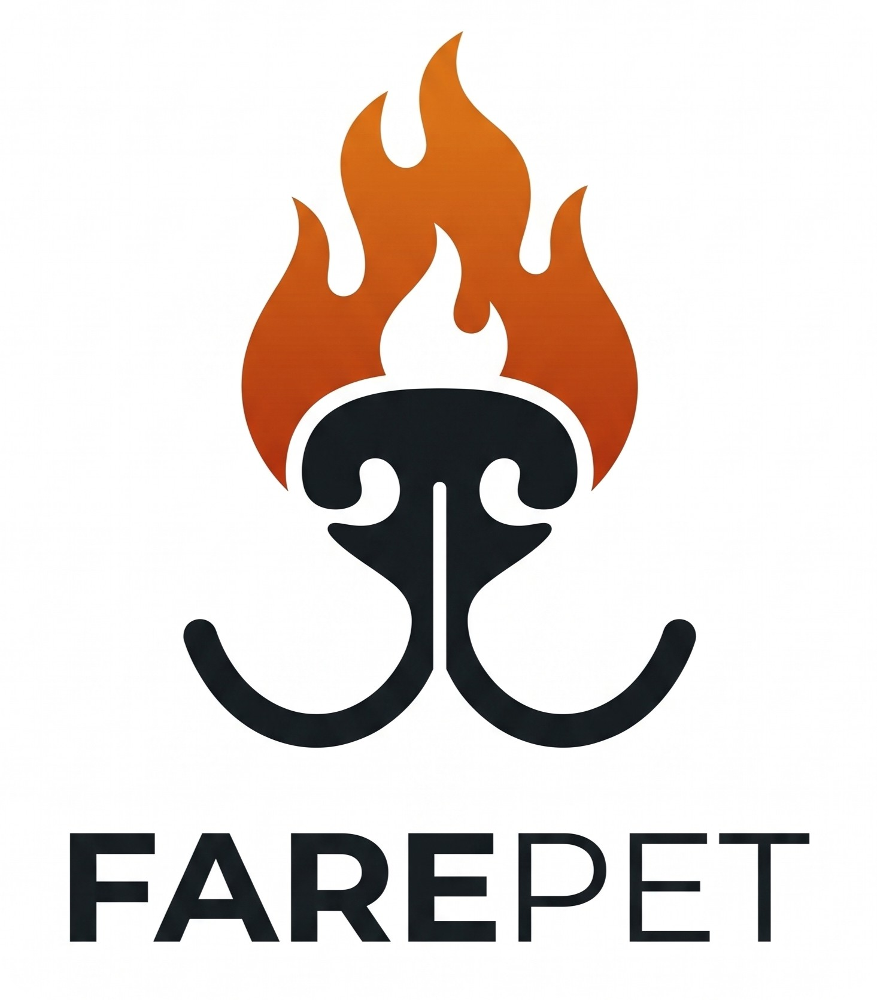

<p align="center">
  
</p>

# 🐾 Farepet

> **Farejar + Pet**: uma plataforma web para ajudar a reunir animais perdidos com seus tutores e encontrar um lar para animais abandonados.

Projeto de Prática Profissional em Análise e Desenvolvimento de Sistemas (Faculdade Grau, disciplina *Projetos Profissionalizantes*).

**Status:** 🚧 Em desenvolvimento (Etapa 4 — Desenvolvimento: Layout base do Front-end concluído)

---

## 📌 Sobre o projeto

Quando um animal some, o tempo é decisivo. Hoje os avisos ficam espalhados em grupos de redes sociais, cartazes e mensagens que se perdem rápido. O **Farepet** centraliza esses avisos em um mapa, permitindo que:

- **Tutores** cadastrem o animal perdido, com fotos, descrição, contato e o local onde ele foi visto pela última vez.
- **Quem encontrou** um animal cadastre onde ele foi localizado, com a opção de fazer isso **de forma anônima**.
- **Interessados em adotar** consultem os animais encontrados em situação de abandono.

A cidade inicial de cobertura é **São Paulo (SP)**.

## ✨ Funcionalidades do MVP

- [x] Cadastro de animal **perdido** (formulário, foto, local, contato - *mockado via LocalStorage*)
- [x] Cadastro de animal **encontrado** (com opção anônima - *mockado via LocalStorage*)
- [ ] Visualização dos anúncios em **mapa** e lista (Filtros e lista de cards funcionais; mapa pendente de integração com Leaflet)
- [x] Página/Modal de **detalhes** do anúncio (com informações dinâmicas e foto)
- [x] Seção de **animais para adoção**

**Fora do MVP (ideias futuras):** contas de usuário, notificações, cruzamento automático entre "perdido" e "encontrado", outras cidades.

## 🛠️ Tecnologias

| Camada | Tecnologia |
|---|---|
| Front-end | HTML5, CSS3, JavaScript (Vanilla) e LocalStorage |
| Mapa | Leaflet + OpenStreetMap (A implementar) |
| Back-end | Node.js + Express (A implementar) |
| Banco de dados | A definir (SQLite ou DynamoDB) |
| Armazenamento de fotos | Amazon S3 (Planejado) |
| Hospedagem | AWS (Planejado) |

## 📁 Estrutura do repositório

```text
PPP_ADS/
├── docs/          # Project Charter, personas e user stories.
├── frontend/      # Front-end da aplicação
│   ├── assets/    # Imagens e logotipos do projeto
│   ├── css/       # Arquivos de estilização (style.css)
│   ├── html/      # Páginas secundárias (cadastro.html)
│   ├── js/        # Scripts e lógicas da página (script.js)
│   └── index.html # Página principal (Home)
├── backend/       # API (Node.js + Express) - Vazio no momento
├── LICENSE        # Licença do projeto
└── README.md      # Documentação principal
```

> A estrutura de `frontend/` e `backend/` será criada no início da Etapa 4 (Desenvolvimento).

## 📄 Documentação do projeto

| Documento | Descrição |
|---|---|
| [Project Charter](docs/Project_Charter_Farepet.md) | Escopo, objetivos, papéis, cronograma e riscos |
| [Personas e User Stories](docs/Personas_UserStories_Farepet.pdf) | Personas do MVP e as 5 user stories priorizadas |

**Quadro Kanban (GitHub Projects):** https://github.com/users/lucasjosebs/projects/1

## ▶️ Como executar

Como o projeto encontra-se na fase de front-end com dados simulados via LocalStorage, você pode executá-lo diretamente no seu navegador, sem necessidade de configurar um servidor local para a API.

1. Clone este repositório em sua máquina:
```bash
git clone [https://github.com/lucasjosebs/PPP-ADS.git](https://github.com/lucasjosebs/PPP-ADS.git)
```
2. Navegue até a pasta de frontend do projeto:
```bash
cd PPP-ADS/frontend
```
3. Abra o arquivo `index.html` em qualquer navegador web (Chrome, Firefox, Edge, etc.).

## 🗺️ Roadmap

| Etapa | Foco | Status |
|---|---|---|
| 1 | Kickoff: Project Charter e repositório | ✅ Concluído |
| 2 | Concepção: personas, user stories e MVP | ✅ Concluído |
| 3 | Organização: backlog e quadro Kanban | ✅ Concluído |
| 4 | Desenvolvimento em sprints | 🔄 Em andamento |
| 5 | Testes e validação | ⏳ Pendente |
| 6 | Encerramento: relatório e apresentação | ⏳ Pendente |

## 👤 Autor

**Lucas José** — [@lucasjosebs](https://github.com/lucasjosebs)

## 📄 Licença

Distribuído sob a licença MIT. Veja o arquivo [LICENSE](LICENSE) para mais detalhes.
